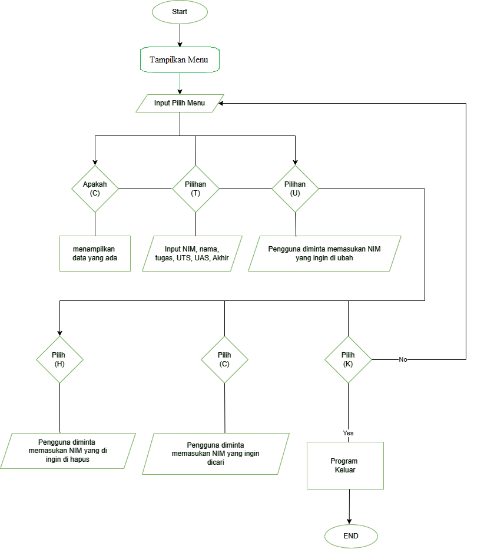

## *Praktikum 6*

Program pertama yang akan dibuat adalah Program untuk menampilkan angka pertama dan kedua dan masukan operator dan mendapat hasil dari input

*Berikut flowchartnya*




*Program akan meminta kita untuk memasukkan nama, nim, nilai tugas, nilai uts, nilai uas dan tambah data :*


**Penjelasan Code**

```
def tampilkan_menu():
    print("\n[(L)ihat, (T)ambah, (U)bah, (H)apus, (C)ari, (K)eluar]:")

def tampilkan_daftar_nilai(daftar_nilai):
    if not daftar_nilai:
        print("Daftar Nilai")
        print("=" * 66)
        print("| NO |    NIM    |     NAMA      | TUGAS  | UTS  | UAS  | AKHIR  |")
        print("=" * 66)
        print("|                       TIDAK ADA DATA                           |")
        print("=" * 66)
    else:
        print("Daftar Nilai")
        print("=" * 66)
        print("| NO |    NIM    |     NAMA      | TUGAS  | UTS  | UAS  | AKHIR  |")
        print("=" * 66)
        for i, data in enumerate(daftar_nilai, start=1):
            print(f"| {i:<2} | {data[0]:<8} | {data[1]:<13} | {data[2]:<6} | {data[3]:<4} | {data[4]:<4} | {data[5]:<6.2f} |")
        print("=" * 66)

def tambah_data(daftar_nilai):
    print("Tambahkan Data")
    nim = input("NIM: ")
    nama = input("Nama: ")
    tugas = float(input("Nilai Tugas: "))
    uts = float(input("Nilai UTS: "))
    uas = float(input("Nilai UAS: "))
    nilai_akhir = (tugas + uts + uas) / 3
    daftar_nilai.append([nim, nama, tugas, uts, uas, nilai_akhir])
    print("Data berhasil ditambahkan.")

def ubah_data(daftar_nilai):
    tampilkan_daftar_nilai(daftar_nilai)
    index = int(input("Pilih nomor data yang ingin diubah: ")) - 1
    if 0 <= index < len(daftar_nilai):
        nim = input("NIM baru: ")
        nama = input("Nama baru: ")
        tugas = float(input("Nilai Tugas baru: "))
        uts = float(input("Nilai UTS baru: "))
        uas = float(input("Nilai UAS baru: "))
        nilai_akhir = (tugas + uts + uas) / 3
        daftar_nilai[index] = [nim, nama, tugas, uts, uas, nilai_akhir]
        print("Data berhasil diubah.")
    else:
        print("Nomor tidak valid.")

def hapus_data(daftar_nilai):
    tampilkan_daftar_nilai(daftar_nilai)
    index = int(input("Pilih nomor data yang ingin dihapus: ")) - 1
    if 0 <= index < len(daftar_nilai):
        daftar_nilai.pop(index)
        print("Data berhasil dihapus.")
    else:
        print("Nomor tidak valid.")

def cari_data(daftar_nilai):
    nim = input("Masukkan NIM yang dicari: ")
    ditemukan = False
    for data in daftar_nilai:
        if data[0] == nim:
            print(f"Data ditemukan: NIM: {data[0]}, Nama: {data[1]}, Tugas: {data[2]}, UTS: {data[3]}, UAS: {data[4]}, Akhir: {data[5]:.2f}")
            ditemukan = True
            break
    if not ditemukan:
        print("Data tidak ditemukan.")

if __name__ == "__main__":
    daftar_nilai = []
    while True:
        tampilkan_menu()
        pilihan = input().lower()

        if pilihan == 'l':
            tampilkan_daftar_nilai(daftar_nilai)
        elif pilihan == 't':
            tambah_data(daftar_nilai)
        elif pilihan == 'u':
            ubah_data(daftar_nilai)
        elif pilihan == 'h':
            hapus_data(daftar_nilai)
        elif pilihan == 'c':
            cari_data(daftar_nilai)
        elif pilihan == 'k':
            print("Keluar dari program.")
            break
        else:
            print("Pilihan tidak valid")


*Penjelasan*
1.	Fungsi tampilkan_menu():
Menampilkan menu pilihan yang tersedia kepada pengguna. Pilihan yang ada adalah melihat data, menambah data, mengubah data, menghapus data, mencari data, dan keluar dari program.
2.	Fungsi tampilkan_daftar_nilai(daftar_nilai):
•	Menerima parameter daftar_nilai, yang merupakan daftar dari data mahasiswa.
•	Jika daftar kosong, menampilkan pesan bahwa tidak ada data. Jika ada data, menampilkan tabel yang berisi NIM, nama, nilai tugas, UTS, UAS, dan nilai akhir dari setiap mahasiswa.
3.	Fungsi tambah_data(daftar_nilai):
•	Meminta pengguna untuk memasukkan data baru (NIM, nama, nilai tugas, UTS, dan UAS).
•	Menghitung nilai akhir sebagai rata-rata dari nilai tugas, UTS, dan UAS.
•	Menambahkan data baru ke dalam daftar_nilai dan memberi tahu pengguna bahwa data berhasil ditambahkan.
4.	Fungsi ubah_data(daftar_nilai):
•	Menampilkan daftar nilai yang ada untuk memungkinkan pengguna memilih data mana yang ingin diubah.
•	Meminta pengguna untuk memasukkan data baru dan menghitung nilai akhir.
•	Mengubah data pada indeks yang dipilih oleh pengguna dan memberi tahu bahwa data berhasil diubah.
5.	Fungsi hapus_data(daftar_nilai):
•	Menampilkan daftar nilai yang ada dan meminta pengguna memilih data mana yang ingin dihapus.
•	Menghapus data pada indeks yang dipilih dan memberi tahu bahwa data berhasil dihapus.
6.	Fungsi cari_data(daftar_nilai):
•	Meminta pengguna untuk memasukkan NIM yang ingin dicari.
•	Mencari NIM dalam daftar nilai dan jika ditemukan, menampilkan data mahasiswa tersebut. Jika tidak ditemukan, memberi tahu pengguna bahwa data tidak ada.
7.	Bagian if _name_ == "_main_"::
•	Menjalankan program. Membuat daftar kosong daftar_nilai untuk menyimpan data mahasiswa.
•	Menggunakan loop while True untuk terus menampilkan menu dan menunggu input pengguna.
•	Berdasarkan pilihan yang dimasukkan oleh pengguna, memanggil fungsi yang sesuai (lihat, tambah, ubah, hapus, cari data, atau keluar).
